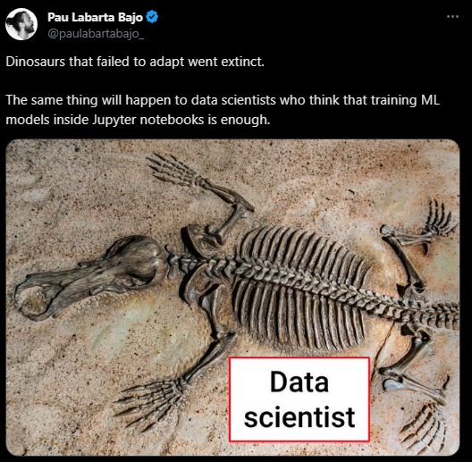
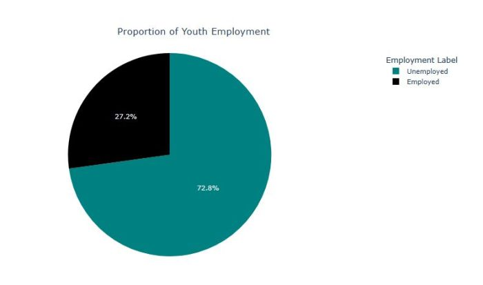
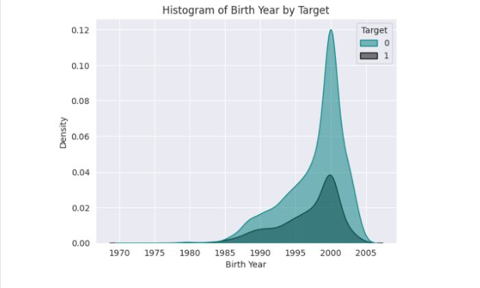
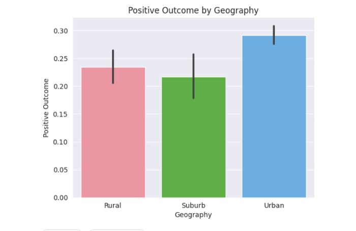

<h1 align="center">Youth Income Prediction Challenge API</h1>

<h3 align="center">A machine learning web app and API for predicting youth income based on data from labour market surveys in South Africa</h3>

You can view the live demo of the web app <a href="https://oyebamiji-micheal-youth-income-prediction-challenge.streamlit.app">here</a>

You can interact with the API <a href="https://web-production-8bd9.up.railway.app/docs">here</a>

<h2>Table of Contents</h2>

- [Overview and Objective](#overview_objective)
- [Dataset](#data)
- [Insights from EDA](#insights)
- [Models and Evaluation Metric](#model)
- [Simple API Doc](#api)

<h2>Overview and Objective</h2>

Up to this moment, I have always deployed my models using Streamlit for easier interaction, testing and sharing. Moving forward, this project and subsequent ones will aim to extend beyond traditional machine learning model development in Jupyter notebooks and web apps by incorporating the development of APIs using FastAPI. Additionally, this project particularly will seek to explore various hyperparameter tuning techniques to optimize the performance of machine learning model.

<h2>Data</h2>

The dataset used in this repository is obtained from a <a href="https://zindi.africa/competitions/predictive-insights-youth-income-prediction-challenge">competition</a> on Zindi. The data comes from four rounds of a survey of youth in the South African labour market, conducted at 6-month intervals. The survey contains numerical, categorical and free-form text responses. Each person in the dataset was surveyed one year prior (the ‘baseline’ data) to the follow-up survey. In a nutshell, the objective of the challenge is to build a machine learning model that predicts whether a person is employed at the follow-up survey based on their labour market status and other characteristics during the baseline. 

<h2>Insights from EDA</h2>

The importance of EDA before model building cannot be overemphasized. EDA provides a clearer picture and understanding of the distribution of the data. This include class-imbalance, outliers, correlation and so on. Below are some of the insights gained from a light EDA:  

- Below is the proportion of people who have a positive outcome and otherwise.  
 

- The ages of candidates with a positive outcome and those with a negative outcome seem to follow a similar distribution.  

- People from "Urban" areas are most likely to get a positive outcome.  

<h2>Model and Evaluation Metric</h2>

For the sake of simplicity, only one type of classification model (LightGBM Classifier) was used in the notebook. Also, the hyperparameter tunning techniques used are GridSearchCV and RandomSearchCV. In subsequent models, I hope to explore the Bayesian Optimization with Gaussian Process. The performance of the base model  however and the tunned ones can be found in the <a href="https://oyebamiji-micheal-youth-income-prediction-challenge.streamlit.app/" style="text-decoration: None;">notebook</a>.  

<h2>Simple API Doc</h2>

<strong>Note: All string inputs are case and whitespace sensitive</strong>

|  input   |   DataType    | Description |   Expected Value  |  
|:--------:|:-------------:|:-----------------:|:-----------------:|
survey_date |   string     |    The date the survey was conducted | The format should be dd-mm-year|
survey_round | int  |   Survey round   | Ranges from 1 to 4
status | string    |   Prior Employment Status | Input should be any of the following:  "Studying", "Unemployed", "Wage Employed", "Self Employed", "Employment Programme", "Wage and Self Employed", "Other" |
tenure  |  int   | Prior Employment Tenure (Days) | Feasible values in range 1 to 220000 |
geography | string | Geography | "Suburb", "Rural", "Urban" |
province | string | Province | Input should be any of the following:   "Mpumalanga", "North West", "Free State", "Eastern Cape", "Limpopo", "KwaZulu-Natal", "Gauteng", "Western Cape", "Northern Cape"
matric | int | Matriculation | Enter 1 if matriculated and 0 otherwise |
degree | int | Degree | Enter 1 if you have a degree and 0 otherwise |
diploma | int | Diploma | Enter 1 if you have a diploma and 0 otherwise |
school_quantile | string | School Quantile | Values range from 0 to 5 |
additional_lang | string | Additional Langauage | Input should be any of the following:   "50 - 59 %", "40 - 49 %", "60 - 69 %", "70 - 79 %", "30 - 39 %", "80 - 100 %" |
gender | int | Gender | 0 corresponds to male while 1 corresponds to Female
sa_citizen | int | South Africa Citizen | Input should be either 0 or 1 
birth_year | int | Birth Year | Feasible values in the range 1950 to 2010 |
birth_month | int | Birth Month | Input range from 1 to 12 |
